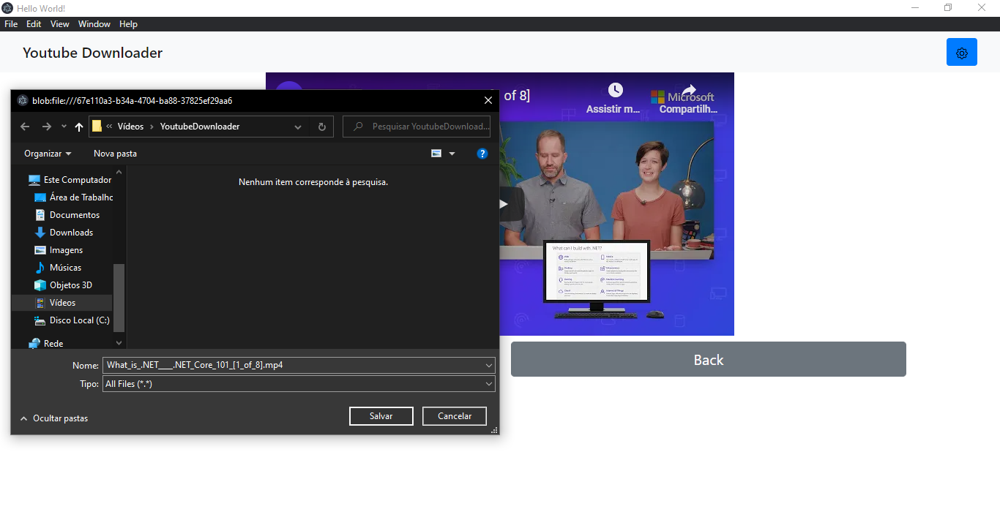

# Youtube Downloader

Youtube Downloader is a program that allow you to dowload videos from youtube.

## Instalation

For now, the only way to install is cloning this repository and build the Client with node and the API with Dotnet Core.

## Usage

1. Insert a Youtube Data Api key if you want to search videos. Without A Youtube api key you may only download videos by URL. Then insert de ip adress of the the api. If it is in your machine, just type "localhost".

1. Search for something then click on Details.

1. Here you can watch the video and/or press the Download button to download it.

1. Now wait for the API to download the video.

1. Now you can choose a folder to save the video.

1. You can also download by the URL. Just paste and click Download.

1. Then you can choose were to save it. 

## Contributing

Pull requests are welcome.  Fell free to open an issue.

## Obs

The UI and the name will certainly change. This is just a preview.
